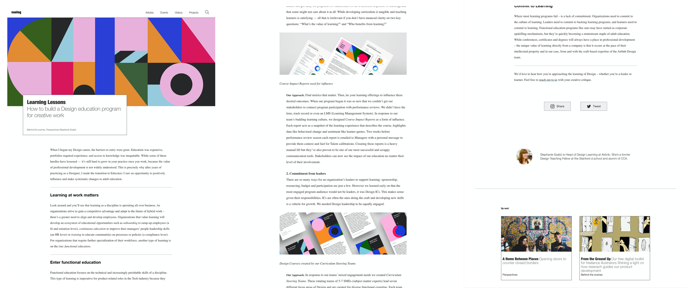

 
 

<!-- Header -->

  

<h1 align="middle">Vuelog</h2>

Blog made with Vue.js

  
  
  
  
  

<a href="https://yejinc.github.io/vuelog/">👉 Project link</a>

 
 

<!-- Content -->

## 📸 screenshots

 

 

<!-- Todo -->

## 👀 Todo list

- [ ] Add infinite articles
- [ ] Create infinite article card API
- [ ] Integrate SASS files
- [ ] Fix blog post card routing bugs
- [ ] Adjust selected post to load from top

 
 
